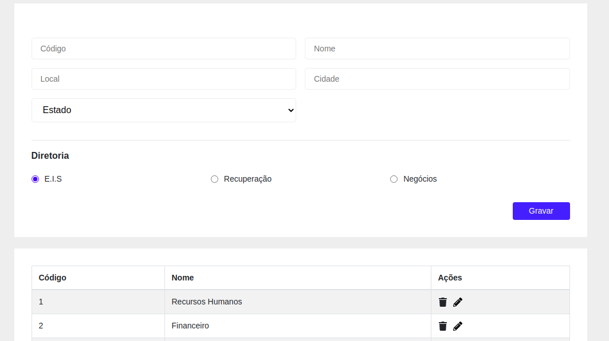
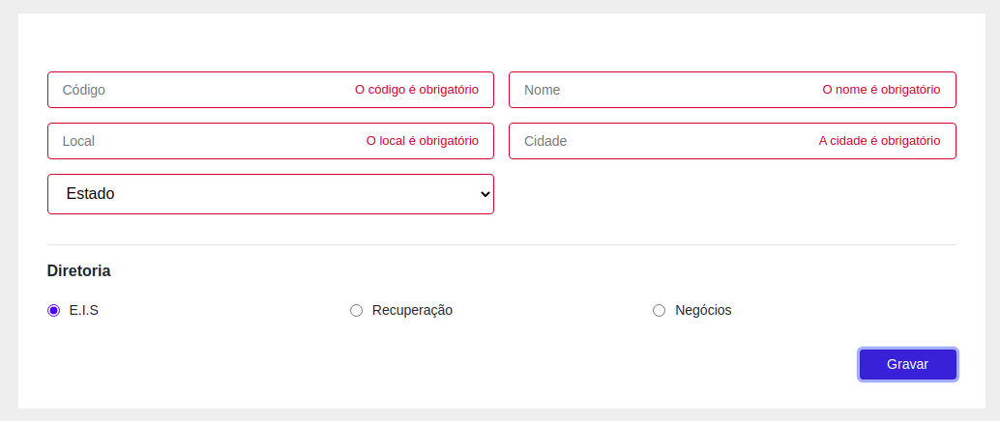
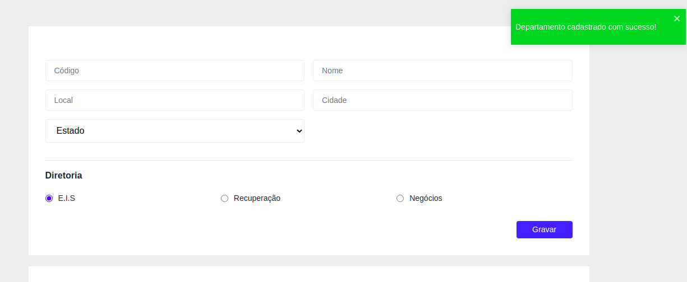
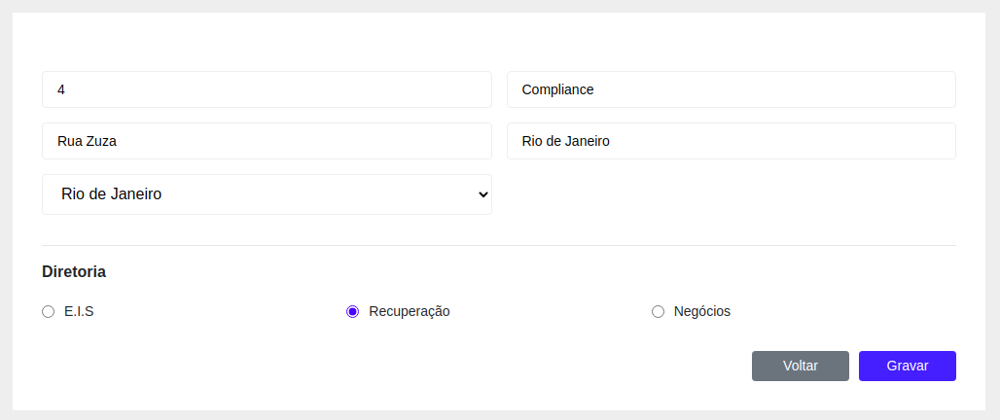
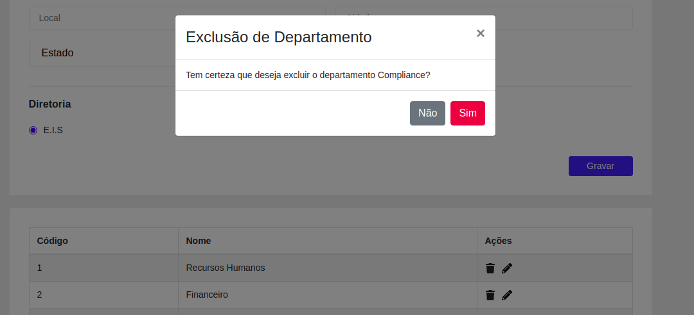
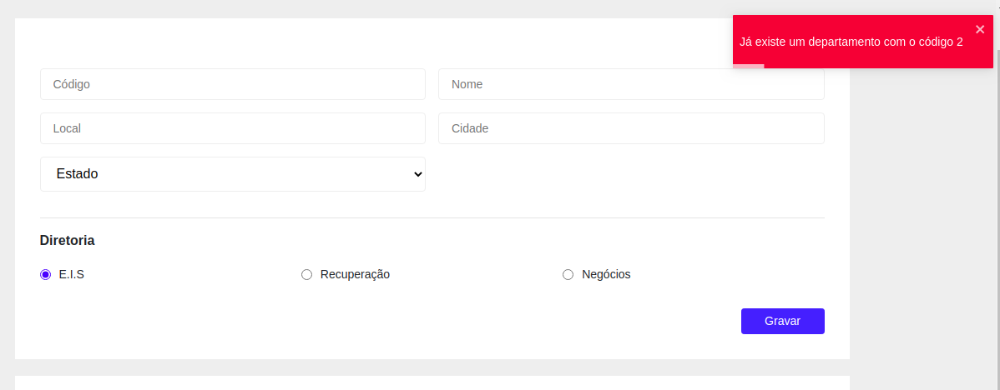

# Aplicação Web do projeto cadastro de departamentos

## Screenshots

### Cadastro e listagem

### Validação dos inputs

### Cadastro realizado com sucesso

### Tela de edição

### Exclusão de um departamento

## Tecnologias

- `ReactJs`
- `Styled Components`
- `Axios`
- `React Bootstrap`
- `Yup`

## Execução da aplicação

Antes de iniciar a aplicação web certifique-se de executar o [backend](https://bitbucket.org/omnifinanceira/java-test-icaro-magnago/src/master/omni-demo-api-clean/)

- Prerequistos
	- Nodejs

Execute 

`yarn install` e depois `yarn start`

Acesse [http://localhost:3000](http://localhost:3000)